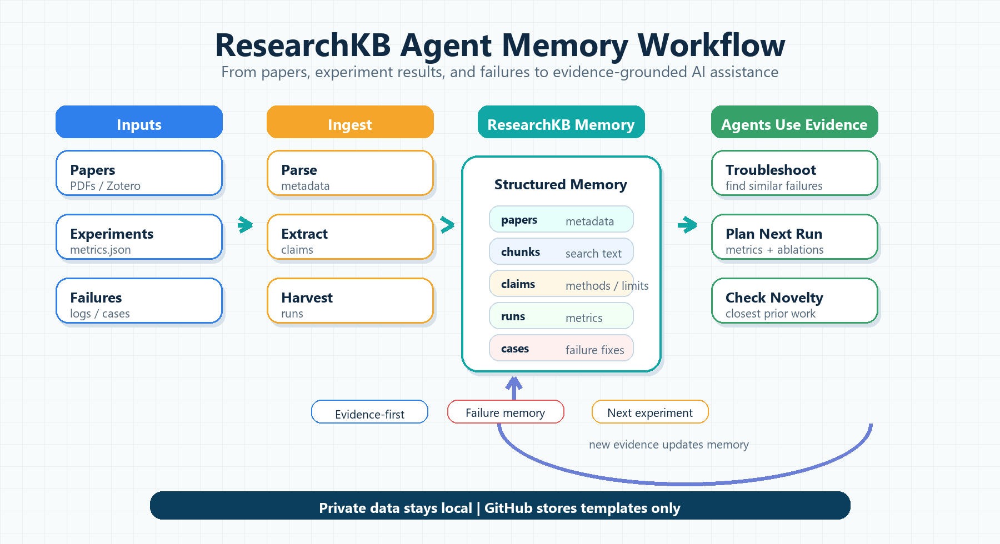

# ResearchKB Agent Memory

[](https://github.com/drongzzz0/obsidian/actions/workflows/ci.yml)

English | [简体中文](README.zh-CN.md)

A lightweight workflow template for giving Codex, Claude Code, Cursor, and other research agents access to local literature evidence, experiment history, and failure memory.



## What This Repo Is

This is a public workflow starter kit for connecting local ResearchKB data to research agents.

It provides:

- public templates
- experiment output contracts
- health-check scripts
- launcher examples
- agent prompt patterns
- privacy rules

It does not provide:

- your private ResearchKB database
- private papers or PDFs
- Zotero profile data
- experiment logs
- API keys
- a hosted RAG service

The demo database generated by this repo is fully synthetic. Use it to verify the workflow before connecting your private ResearchKB root.

## What It Does

Research agents are more useful when they can query evidence instead of relying only on the current chat. This repo provides public, portable glue for that workflow:

- **Literature memory:** ingest papers, PDFs, Zotero exports, and notes into ResearchKB.
- **Experiment memory:** harvest `metrics.json`, `results.json`, logs, and summaries from project output folders.
- **Failure memory:** record failed runs, symptoms, fixes, and final solutions as searchable cases.
- **Agent usage:** let Codex, Claude Code, or Cursor query ResearchKB before troubleshooting, planning, or checking novelty.

The actual database, PDFs, logs, secrets, and machine-specific config stay outside Git.

## Quick Start

### PowerShell

```powershell
git clone https://github.com/drongzzz0/obsidian.git
cd obsidian
```

Create a synthetic demo database and query it:

```powershell
python .\scripts\init_researchkb_workspace.py
python .\scripts\standardize_run.py .\.runtime\example-project\runs\smoke-test
python .\scripts\auto_standardize_runs.py --paths-file .\.runtime\researchkb\config\auto_harvest_paths.txt --project "Smoke Test"
python .\scripts\seed_demo_db.py
python .\researchkb\rk_health.py --root .\.runtime\researchkb
python .\scripts\query_demo.py --root .\.runtime\researchkb latest-runs
```

### Bash

```bash
git clone https://github.com/drongzzz0/obsidian.git
cd obsidian
python scripts/init_researchkb_workspace.py
python scripts/standardize_run.py .runtime/example-project/runs/smoke-test
python scripts/auto_standardize_runs.py --paths-file .runtime/researchkb/config/auto_harvest_paths.txt --project "Smoke Test"
python scripts/seed_demo_db.py
python researchkb/rk_health.py --root .runtime/researchkb
python scripts/query_demo.py --root .runtime/researchkb latest-runs
```

The generated demo creates:

- a local `.runtime/researchkb` scaffold
- a local `.runtime/example-project/runs/smoke-test` run
- `config/auto_harvest_paths.txt`
- parseable `metrics.json` and `summary.json`
- a standardized `run_record.json`
- a synthetic `.runtime/researchkb/db/literature.sqlite` database

The public demo DB contains synthetic papers, chunks, claims, evidence links, experiment runs, and failure cases. It is not your real ResearchKB.

After the demo works, point the scripts at your private ResearchKB installation:

```powershell
python .\scripts\init_researchkb_workspace.py --root "<ResearchKBRoot>" --project-root "<ProjectRoot>"
```

See [docs/quickstart.md](docs/quickstart.md) for the full 10-minute loop.

## How To Use With Agents

Use direct prompts like these:

```text
This experiment failed. Search ResearchKB for similar failures and fixes before suggesting a solution.
```

```text
Based on recent experiment results and paper evidence, propose the next experiment plan.
```

```text
Check this idea against ResearchKB and public literature metadata. What is the closest prior work?
```

A good agent answer should cite evidence from recent runs, relevant papers, and failure cases when available.

## Experiment Output Contract

Experiments should emit at least one parseable artifact:

```text
metrics.json
results.json
summary.json
eval_results.json
```

or log lines like:

```text
METRIC accuracy=0.842
METRIC latency_ms=128.5
METRIC peak_memory_mb=9216
```

If a project emits mixed `metrics.json`, `results.json`, `eval_results.json`, `summary.json`, or `METRIC key=value` logs, normalize one run directory before harvesting:

```powershell
python .\scripts\standardize_run.py "<ProjectRoot>\runs\<run-id>"
```

This writes `run_record.json` with normalized fields such as `run_id`, `dataset`, `model`, `sample_count`, `quality_retention`, `latency_ms`, `failure_type`, `decision`, and `next_action`.

For unattended capture, point the batch standardizer at your watched paths:

```powershell
python .\scripts\auto_standardize_runs.py --paths-file "<ResearchKBRoot>\config\auto_harvest_paths.txt" --project "<ProjectName>"
```

Run that command before your ResearchKB harvest command in a scheduled task, cron job, or experiment wrapper. New or stale run folders get a fresh `run_record.json`; already standardized folders are skipped.

For the generic contract, see [researchkb/contracts/experiment_metrics_contract.md](researchkb/contracts/experiment_metrics_contract.md).
For KV-cache reuse work, see [researchkb/contracts/kv_cache_reuse_metrics_contract.md](researchkb/contracts/kv_cache_reuse_metrics_contract.md).

## Repository Layout

```text
.
|-- CHANGELOG.md
|-- CONTRIBUTING.md
|-- LICENSE
|-- ROADMAP.md
|-- SECURITY.md
|-- pyproject.toml
|-- .github/
|   `-- workflows/
|       `-- ci.yml
|-- assets/
|   `-- readme-workflow-v2.png
|-- docs/
|   |-- quickstart.md
|   |-- architecture.md
|   |-- schema_minimal.md
|   `-- agent_tool_contracts.md
|-- schemas/
|   |-- experiment_metrics.schema.json
|   |-- problem_case.schema.json
|   |-- paper.schema.json
|   |-- chunk.schema.json
|   |-- claim.schema.json
|   `-- evidence_link.schema.json
|-- examples/
|   |-- smoke-run/
|   |-- failure-case/
|   |-- paper-memory/
|   `-- agent-answers/
|-- launchers/
|   `-- Claude Code launcher templates
|-- researchkb/
|   |-- contracts/
|   |   |-- experiment_metrics_contract.md
|   |   `-- kv_cache_reuse_metrics_contract.md
|   |-- auto_harvest_paths.example.txt
|   |-- kv_experiment_metrics_contract.md
|   |-- rk-health.cmd
|   `-- rk_health.py
|-- scripts/
|   |-- auto_standardize_runs.py
|   |-- cursor_mcp_smoke.py
|   |-- init_researchkb_workspace.py
|   |-- public_repo_scan.py
|   |-- query_demo.py
|   |-- seed_demo_db.py
|   |-- standardize_run.py
|   `-- validate_examples.py
|-- tests/
|   |-- test_init_researchkb_workspace.py
|   |-- test_public_repo_scan.py
|   `-- test_rk_health.py
|-- .gitignore
|-- .public-scan-local.example.txt
|-- README.zh-CN.md
`-- README.md
```

## Included Helpers

- `researchkb/rk-health.cmd`: checks ResearchKB, watched paths, logs, and recent experiment-memory coverage.
- `researchkb/auto_harvest_paths.example.txt`: safe watch-list template.
- `researchkb/contracts/experiment_metrics_contract.md`: generic experiment output contract.
- `researchkb/contracts/kv_cache_reuse_metrics_contract.md`: KV-cache reuse metric and safety extension.
- `researchkb/kv_experiment_metrics_contract.md`: compatibility pointer for older links.
- `scripts/init_researchkb_workspace.py`: creates a local smoke workspace and prints the next health/harvest commands.
- `scripts/seed_demo_db.py`: creates a fully synthetic demo SQLite database under `.runtime/researchkb`.
- `scripts/query_demo.py`: queries the synthetic demo DB.
- `scripts/standardize_run.py`: converts mixed experiment outputs and `METRIC key=value` logs into `run_record.json`.
- `scripts/auto_standardize_runs.py`: scans watched paths and incrementally writes missing or stale `run_record.json` files.
- `scripts/validate_examples.py`: validates example JSON files against schemas.
- `scripts/public_repo_scan.py`: scans public files for local paths, secret-like values, and private traces.
- `scripts/cursor_mcp_smoke.py`: lightweight Cursor MCP config smoke test.
- `launchers/`: optional Claude Code launcher templates. Keep real API keys outside this repo.

## Examples

- [examples/smoke-run](examples/smoke-run): minimal `metrics.json` and `summary.json` for the first ingestion test.
- [examples/standardized-run](examples/standardized-run): synthetic normalized `run_record.json` output.
- [examples/failure-case](examples/failure-case): a synthetic reusable failure case.
- [examples/paper-memory](examples/paper-memory): paper, chunk, claim, and evidence-link records.
- [examples/agent-answers](examples/agent-answers): good vs bad troubleshooting answers.

## Design Docs

- [docs/quickstart.md](docs/quickstart.md): clone -> bootstrap -> health check -> harvest -> agent prompt.
- [docs/architecture.md](docs/architecture.md): project run -> harvest -> ResearchKB -> agent query loop.
- [docs/schema_minimal.md](docs/schema_minimal.md): minimal records and evidence provenance fields.
- [docs/agent_tool_contracts.md](docs/agent_tool_contracts.md): expected tool inputs, outputs, and evidence-grounded answer format.

## Privacy Rules

Do not commit:

- API keys or auth tokens
- SSH keys or local credentials
- local absolute paths
- personal usernames or hostnames
- ResearchKB databases
- Zotero profiles
- private PDFs
- experiment logs and generated artifacts

Use placeholders in public examples:

```text
<ResearchKBRoot>
<ProjectRoot>
<workspace-or-output-dir>
```

Suggested pre-push checks:

```powershell
rg -n "sk-|api[_-]?key|auth[_-]?token|password|secret|bearer" .
rg -n "<your-username>|<private-host>|<private-project-name>" .
git status -sb --ignored
```

## Development Checks

```powershell
python -m py_compile .\researchkb\rk_health.py .\scripts\cursor_mcp_smoke.py .\scripts\init_researchkb_workspace.py .\scripts\public_repo_scan.py .\scripts\seed_demo_db.py .\scripts\query_demo.py .\scripts\standardize_run.py .\scripts\validate_examples.py
python -m ruff check .
python -m pytest -vv --tb=short
python .\scripts\validate_examples.py
python .\scripts\public_repo_scan.py .
```

```powershell
$env:RESEARCHKB_ROOT = "<ResearchKBRoot>"
.\researchkb\rk-health.cmd --json
```

## Day-1 Setup: Harvest One Run

Start by making one fake or real experiment run searchable. Do not configure the whole stack first.

```powershell
python .\scripts\init_researchkb_workspace.py --root "<ResearchKBRoot>" --project-root "<ProjectRoot>"
```

The script prints the exact next commands. They are equivalent to:

```powershell
python .\researchkb\rk_health.py --root "<ResearchKBRoot>"
"<ResearchKBRoot>\rk-harvest.cmd" --project "Smoke Test" "<ProjectRoot>\runs\smoke-test"
```

Then ask your agent:

```text
Find the latest Smoke Test run in ResearchKB and tell me what metrics were recorded.
```

If the agent can answer that, the loop works. Add real projects, Zotero exports, Obsidian notes, launchers, and scheduled harvesting only after this first run is queryable.

## Customize After The First Loop Works

| Next step | Do this only when |
| --- | --- |
| Add more watched folders | One run can already be harvested and queried |
| Add Zotero or PDF ingestion | You know the experiment-memory path works |
| Change schema mapping | Your ResearchKB tables or fields differ |
| Add domain metrics | The generic `metrics.json` is not enough |
| Add model launchers | You need separate local entrypoints for different providers |
