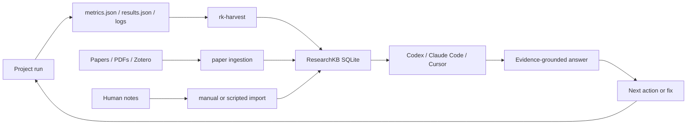

# Architecture

ResearchKB Agent Memory is a local-first workflow for making research evidence queryable by AI agents. It is not a hosted RAG service and does not require private data to be committed to Git.

## Closed Loop



## Component Boundaries

| Component | Responsibility | Not responsible for |
| --- | --- | --- |
| ResearchKB | Store searchable papers, claims, runs, failures, and evidence links | Hosting private data publicly |
| Zotero | Manage papers and metadata | Acting as the agent query layer |
| Obsidian | Human notes, reading summaries, planning drafts | Replacing structured ResearchKB records |
| `rk-harvest` | Ingest experiment outputs into ResearchKB | Running experiments |
| Codex / Claude Code / Cursor | Query evidence, edit code, run checks, propose fixes | Trusting unsupported claims |
| GitHub repository | Public templates, contracts, helper scripts, docs | Private PDFs, DBs, logs, tokens, machine paths |

## Evidence-Grounded Answer Flow

An agent should not jump directly from a user question to a recommendation. The expected flow is:

1. Classify the request: failure diagnosis, next experiment, novelty check, literature search, or result interpretation.
2. Query the relevant ResearchKB records.
3. Return source IDs and locators for the evidence used.
4. Separate direct evidence from inferred reasoning.
5. State missing context when evidence is insufficient.
6. Recommend a concrete action with a verification step.

## Privacy Boundary

The public repository may contain:

- schemas and contracts
- synthetic examples
- helper scripts
- README diagrams
- launcher templates without secrets

The public repository must not contain:

- private ResearchKB databases
- private PDFs
- Zotero profiles
- experiment logs
- API keys or auth tokens
- absolute local paths
- personal usernames or hostnames

## Minimal Deployment Shape

```text
public repository
  -> templates and helper scripts

local ResearchKB root
  -> SQLite database
  -> paper text and claim indexes
  -> experiment run records
  -> failure cases

project workspace
  -> metrics.json
  -> results.json
  -> logs

agent runtime
  -> calls ResearchKB tools
  -> cites evidence IDs
  -> proposes next actions
```
